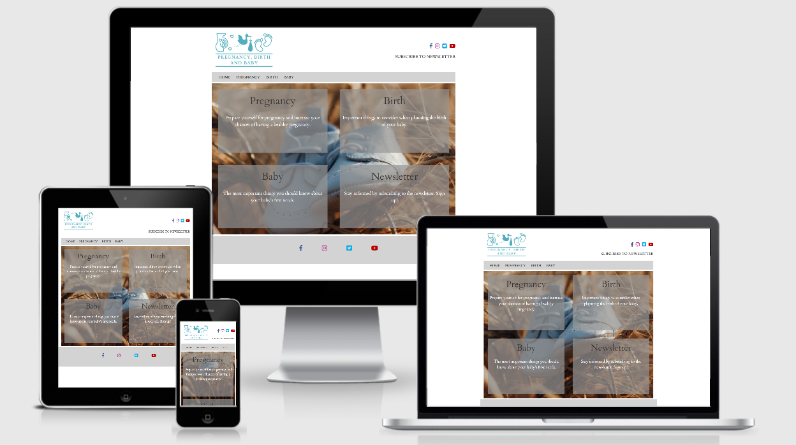

# Pregnancy, Birth and Baby

[View the project here](https://domnicah.github.io/Parenting/)

The project intends to be a guideline for women to discover information about pregnancy, giving birth and babies. The aim is to inform users in the best possible way about becoming and being a parent, and to raise awarness about the most important steps in their journey as a parent.

It is designed to be responsive on a range of devices and easy to navigate to find information related to the subject.

<h2 align="center"></h2>

## User Experience (UX)

  ### User stories

   #### First Time Visitors Goals

- As a woman, I want to find reliable and useful information about pregnancy and babies.
- As a woman, I want to find an intuitive website, easy to navigate to find information.
- As a woman, I want to find well-structered information related to the topics.
- As a woman, I want to find a signup form for the latest news regarding conceiving, pregnancy, birth, babies and any other relevant articles. 

#### Returning Visitor Goals

- As a returning visitor, I want to find useful and updated information.
- As a returning visitor, I want to find social links to a comunity build around the website topics.

#### Frecvent Users Goals

-  As a Frequent User, I want to find if there are new topics and recommendations. 
-  As a Frequent User, I want to subscribe to the newsletter, so I am informed about any updates to the website and it's content.
-  As a Frequent User, I want to find new information and tools relevant to Mothering. 

## Design

#### Imagery

The logo I created is useful for the site because is underling the title of the website, associating those three elements with the meaning of being pregnant, delivery the baby and the baby. 
I choose a neutral home page background image, as to be in concordance to the other pages, making the reading of the information and navigation through the website more easily. The otherpages images were chosen to be relevant to the topic and to be easy to follow.
The images used are representative for the subjects approached and they have a high resolution for a better style. 

#### Colors

The colour scheme chosen is associated with the babies, pink and blue, and the grey used makes the information to be followed easily.  

#### Typography

The main font used is "Cardo" with "Sans Serif" as a backup font. I chose this font because I considered is easy to follow and read. 

## Wireframes

I created wireframes for Main Pages on desktop, smartphone and tablet using Balsamiq - [View](https://github.com/DomnicaH/Parenting/tree/main/wireframes)  
On all pages I chosen to take out search bar as I considered is not very useful on this stage of the project and as the mentor, Aaron suggested. 
The pregnancy.html page doesn't follow the structure entirely, as I chose to show it on vertical rather than horizontal as I found it easy to integrate on the page. Also, the menu on small devices is not a dropdown menu with the icon. 

## Features

The most important feature I concentrated more was to be responsive on different device sizes. Also, it has a clear navigation, reliable and useful information, social media platforms and sign up to newsletter form.

### Features I want to add

In the future, I would like to extend the project and write about toddler's life and challenges in their milestones development, to add more dynamicity and interaction for the users, like a forum for discussion and links to useful organisation relevant to the site users. Also, I want to create flyers with a well-structured information integrated into the webpages that can be printable and be used to inform women and parents about the most important things for having a healthy pregnancy and babies. 
Also, I want to develop the topics and add more information related and relevant to the subject. 
Adding support for the dual language is a feature that I want to implement as the project extended. 

## Technologies Used

1. HTML
2. CSS
3. Bootstrap (4.5.2)
4. Font Awesome
5. Google Fonts
6. GitHub
7. Balsamiq 
8. Canva
9. Unsplash
 

## Testing

The W3C CSS Validator Services and W3C Markup Validator was used to validate every page of the project to ensure there were no syntax errors in the project.

- [W3C CSS Validator] - [Results](https://github.com/DomnicaH/Parenting/tree/main/documentation/w3validator)
- [W3C Markup Validator] - [Results](https://github.com/DomnicaH/Parenting/tree/main/documentation/w3validator)

### Testing User Stories from User Experience (UX) Section

   #### First Time Visitor Goals

   1. As a First Time Visitor, I want to find reliable and useful information about pregnancy and babies. 
    - On the Home page, users can see a logo with the title of the website, that suggests the main topics of interest. Also, an easily readable navigation bar is linking to go to the page of their interest. 
    - Underneath the Menu bar is a Hero Image with an overlay text with opacity on the overlay background and text animation to help the text to stand out and draw the users attention.

   2. As a First Time Visitor, I want to find an intuitive website, easy to navigate to find information.

    - The website has been designed to be intuitive.  At the top of each page, there is a clean navigation bar, with clear description raw about what should they expect navigating through the page. 
    - Logo image is linked to the Home Page to be easy to rich the main page. 

   3. As a First Time Visitor, I want to find well-structured information related to the topics.

    - The pages have clear pages with relevant images for the text near them. The text has a clear and succinct structure for being easy to read. 

   4. As a First Time Visitor, I want to find a signup form for the latest news regarding conceiving, pregnancy, birth, babies and any other relevant articles.

    -  The Newsletter Subscribe page can be riched easily from every page on the top right of the header.

 #### Returning Visitor Goals

   1.  As a returning visitor, I want to find useful and updated information. 

     - There is a link to Subscribe to Newsletter on every page.     
     
   2. As a returning visitor, I want to find social links to a community build around the website topics.

     - The Header and the Footer contain links to the Social Media pages and they open in a new tab to ensure the user can easily get back to the website.

#### Frecvent User Goals

  1. As a Frequent User, I want to find if there are new topics and recommendations. 
  2. As a Frequent User, I want to subscribe to the newsletter, so I am informed about any updates to the website and its content. 
  3. As a Frequent User, I want to find new information and tools relevant to Mothering. 
    - The user has the option to subscribe to the newsletter.

### Further Testing

- The website was tested on Google Chrome, Microsoft Edge.
- The website was viewed on a variety of devices such as Laptop 17" and 15.6", iPhone7, iPhone 11.
- Friends and family members were asked to review the site and documentation to point out any bugs and/or user experience issues.

### Known Bugs
- On small mobile devices, the link to the Home page via the logo is not working. 

### Deployment

#### GitHub Pages
The project was deployed to GitHub Pages using the following steps...

1. Log in to GitHub and locate the GitHub Repository
2. At the top of the Repository (not top of page), locate the "Settings" Button on the menu.
  -  Alternatively Click Here for a GIF demonstrating the process starting from Step 2.
3. Scroll down the Settings page until you locate the "GitHub Pages" Section.
4. Under "Source", click the dropdown called "None" and select "Master Branch".
5. The page will automatically refresh.
6. Scroll back down through the page to locate the now published site link in the "GitHub Pages" section.

### Credits

- The subscription form was inspired from "I love runnin" project. 
- Bootstrap4: Bootstrap Library used throughout the project mainly to make site responsive using the Bootstrap Grid System.
- text sources: Raisingchildren(Birth: an overview) ("https://raisingchildren.net.au/pregnancy/labour-birth/vaginal-caesarean-birth/birth-overview", https://www.who.int/ ).

### Content
 All content was written by me.

### Media
The logo image was created by me in Canva; the other images used are from Canva and Unsplash. 

### Acknowledgements
My Mentor for continuous helpful feedback.
Tutor support at Code Institute for their support.

